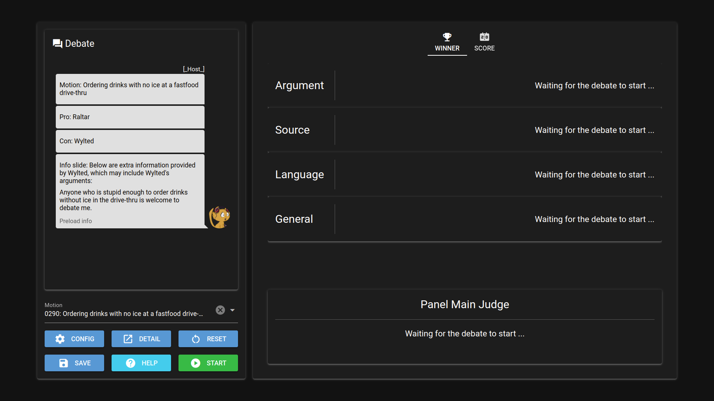
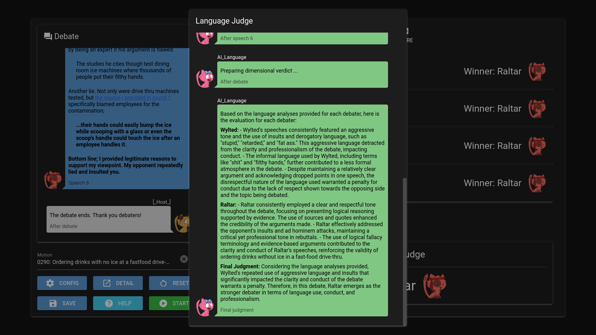
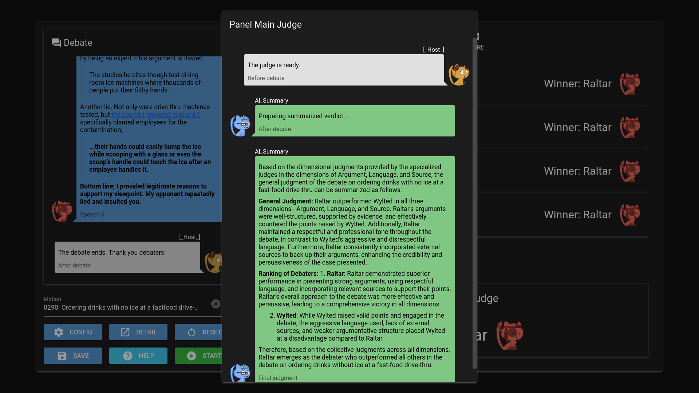
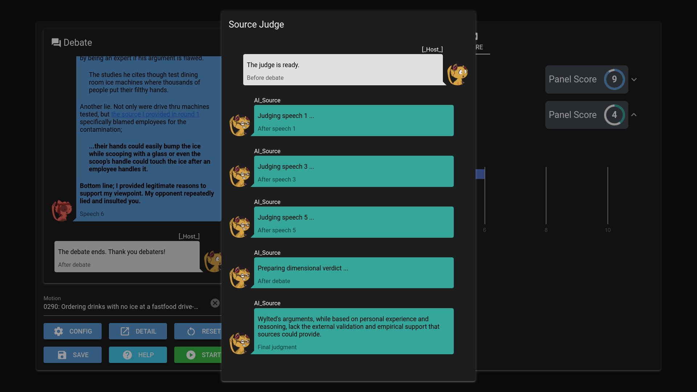
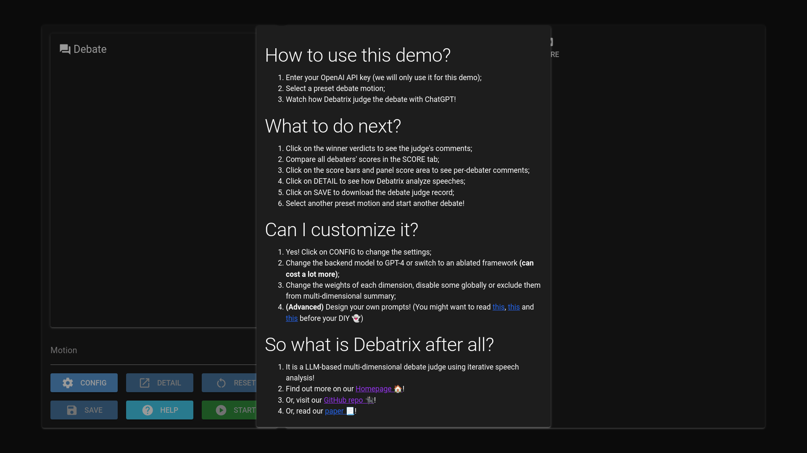

# Debatrix: LLM-based Multi-dimensional Debate Judge with Iterative Chronological Analysis

This is the code repository of *Debatrix: Multi-dimensional Debate Judge with
Iterative Chronological Analysis based on LLM*.

- [Homepage](https://ljcleo.github.io/debatrix)
- [Paper](https://arxiv.org/abs/2403.08010)
- [Demo](https://debatrix.hzmc.xyz:8123)
- [Dataset (PanelBench)](https://github.com/ljcleo/debatrix/releases/tag/v0.1)

## Setup

Debatrix runs on Python 3.11 and above. We recommend using
[Miniconda](https://docs.conda.io/en/latest/miniconda.html) to set up a virtual
environment:

```Shell
conda create -n debatrix python=3.11
```

To run the batch judging script, the following packages are required:

```Shell
pip install fastapi jinja2 langchain openai tiktoken uvicorn
```

To run the UI demo, [NiceGUI](https://nicegui.io) is also needed:

```Shell
pip install nicegui
```

## Batch Judging

An OpenAI API key is required to call ChatGPT or GPT-4 in Debatrix; fill it in
the `api_key` option in `preset/example/config/model.yml`. Base URL and proxies
can also be set on demand.

```YAML
# preset/example/config/model.yml

# ... (there are two openai_config option sets; set up both of them)
  openai_config:
    model: gpt-3.5-turbo-0125
    api_key: "sk-API-KEY-HERE"
    base_url: https://api.openai.com/v1
    proxy: ""
# ...
```

Now, use `run_batch.py` to judge debates in the command line. For example, to
judge the first example debate three times, including multi-dimensional summary,
using ChatGPT as the backbone:

```Shell
python run_batch.py -s -l chatgpt -r test example debatrix 0 1 3
```
fy: if show No model named 'tenacity''，please 
```shell
pip install tenacity
pip install tiktoken numpy langchain
```

After Debatrix finishes judging the debate, the summary score and winner verdict
will be printed on the screen. You can find debate records in
`test/debatrix/resource/record`.

Run `python run_batch.py -h` to see all available command arguments.

## UI Demo

Use `run_demo.py` to launch the Debatrix UI demo:

```Shell
python run_demo.py -i example ANY_SECRET_STRING_YOU_LIKE
```

When the script starts running, open <https://localhost:58000> in a browser to
visit the demo. In the first run, an intro dialog will be displayed; remove the
`-i` option to disable it. In the intro dialog, enter an OpenAI API key, select
a preset debate motion, and click on "START!" to launch the debate.


Run `python run_demo.py -h` to see all available command arguments.
Configuration is also available in the UI demo by clicking on the "CONFIG"
button.


~~*Note: this demo is a singleton application; it does not support multiple sessions.*~~

***UPDATE (2024-3-18): The demo now supports multiple sessions!***

## Screenshots

### Before/After Debate




### Judge Comments




### Per Debater Score




### Analysis Details


### Help Dialog



## Dataset (PanelBench)

The PanelBench dataset is released in the
[Release Page](https://github.com/ljcleo/debatrix/releases/tag/v0.1) of this
repository. It has the following structure:

```Text
PanelBench.tar.gz
├── data
│   ├── BP-Competition.tar.gz
│   │   ├── gold
│   │   │   └── gold.csv
│   │   ├── motion
│   │   │   └── bp_{id}.yml
│   │   └── speech
│   │       └── bp_{id}.yml
│   └── DebateArt.tar.gz
│       ├── gold
│       │   ├── dimension.csv
│       │   └── final.csv
│       ├── motion
│       │   └── debateart_{id}.yml
│       └── speech
│           └── debateart_{id}.yml
├── debatrix_config
│   ├── BP-Competition
│   │   ├── dimension.yml
│   │   └── panel.yml
│   └── DebateArt
│       ├── dimension.yml
│       └── panel.yml
└── README.md
```

### Data

Motions and speeches are in the `data` folder. For each debate set, extract the
`.tar.gz` archive into the `preset` folder of Debatrix. The `gold` folder
contains true results of the debates; Debatrix doesn't need them, but you can
use them to verify Debatrix's judgments.

### Debatrix Config

Dimension and judge configs are in the `config` folder. For each debate set,
move the folder to the one extracted to `preset` in the previous section, and
rename it to `config`. Copy the other configs (`model.yml`, `manager.yml`,
`recorder.yml`) from `preset/example/config` in Debatrix to the renamed `config`
folder.

## Citation

If you find our Debatrix or PanelBench useful, please consider citing our paper:

```BibTeX
@InProceedings{Liang2024Debatrix,
  author    = {Liang, Jingcong and Ye, Rong and Han, Meng and Lai, Ruofei and Zhang, Xinyu and Huang, Xuanjing and Wei, Zhongyu},
  booktitle = {Findings of the Association for Computational Linguistics ACL 2024},
  title     = {Debatrix: Multi-dimensional Debate Judge with Iterative Chronological Analysis Based on {LLM}},
  year      = {2024},
  address   = {Bangkok, Thailand and virtual meeting},
  editor    = {Ku, Lun-Wei and Martins, Andre and Srikumar, Vivek},
  month     = aug,
  pages     = {14575--14595},
  publisher = {Association for Computational Linguistics},
  doi       = {10.18653/v1/2024.findings-acl.868},
  url       = {https://aclanthology.org/2024.findings-acl.868},
}
```
